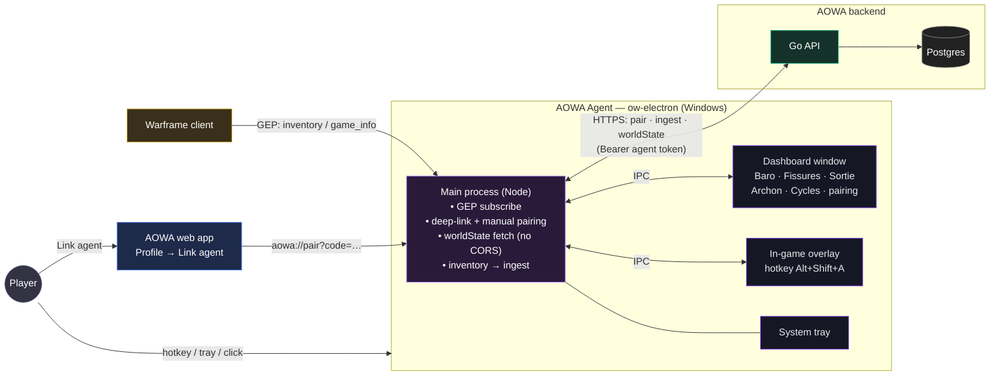
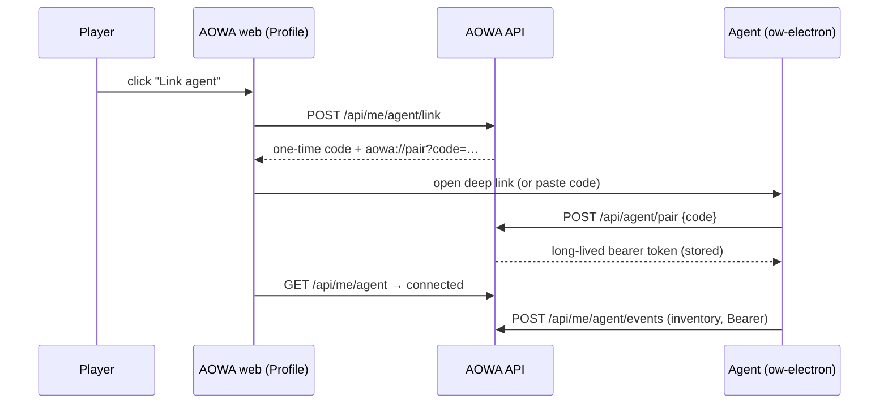

# AOWA Agent (ow-electron) — #34 P2

Desktop companion for [AOWA](https://aowa.ashguard.io): a Warframe **overlay +
dashboard** powered by AOWA's data, with optional live **GEP inventory sync**.
Built on **[ow-electron](https://dev.overwolf.com/ow-electron/)** (Overwolf's
Electron fork) so it gets Overwolf's Game Events Provider (GEP) and in-game
overlay while being **self-distributed** — no consumer app-store listing.

> **Why ow-electron (not native Overwolf):** the native-Overwolf build was
> rejected by the store as a "background/websocket relay." ow-electron is
> white-label + self-distributed, so that policy doesn't apply, and it still
> gives GEP (Warframe **is** supported — `Warframe = 8954` in
> `overwolf/ow-electron-packages-types`) + overlay. The previous native scaffold
> is in git history.

## Front-facing features (the value lives in the app)
- **Dashboard window** — live from AOWA: Baro Ki'Teer (location + countdown),
  Void Fissures, Sortie, Archon Hunt, open-world cycles. Plus pairing controls.
- **In-game overlay** (hotkey **Alt+Shift+A**) — a compact glance: Baro, top
  fissures, cycles.
- **System tray** — open dashboard / toggle overlay / quit.
- **Inventory sync** (background) — GEP inventory → AOWA (owned gear + relic
  counts), a supporting feature, not the whole app.

## Architecture



Pairing handshake:



## Layout
| Path | Role |
| --- | --- |
| `src/main/main.ts` | Electron main: windows, tray, GEP subscribe → ingest, deep-link pairing, IPC |
| `src/main/preload.ts` | contextBridge API for the renderer |
| `src/main/store.ts` | agent-token persistence (userData JSON) |
| `src/renderer/dashboard.*` | main dashboard window |
| `src/renderer/overlay.*` | in-game overlay window |
| `src/renderer/panels.ts` | shared render helpers (Baro/fissures/cycles/…) |
| `src/lib/aowa-data.ts` | AOWA worldState client (fetched in main; CORS-safe) |
| `src/lib/api.ts` | AOWA agent API (pair + ingest) |
| `src/lib/inventory.ts` | GEP inventory → `{name,count}[]` normalizer |
| `src/lib/deeplink.ts` | `aowa://pair?code=` parser |

CORS note: the renderer never calls AOWA directly (Chromium would block it);
worldState is fetched in the **main** process (Node, no CORS) and passed over IPC.

## For testers — run from source (Windows)
No installer yet: run the agent straight from the repo. This uses **Dev Mode**,
so the gaming packages (GEP inventory + overlay) work with just the dev key.

**Prerequisites:** Windows 10/11, [Node.js](https://nodejs.org) 20+, [Git](https://git-scm.com),
and Warframe installed. **You'll be given an `OW_DEV_KEY` separately.**

```powershell
# 1. Get the code
git clone https://github.com/Ezeqielle/aowa-agent.git
cd aowa-agent

# 2. Install dependencies (downloads the ow-electron runtime)
npm install

# 3. Create a .env file with the key you were given (see .env.example)
#    The file must contain exactly this line:
#    OW_DEV_KEY=<the-key-you-were-given>
copy .env.example .env
notepad .env

# 4. Build + launch (Dev Mode)
npm run start:dev
```

Then in the AOWA window: **Link agent** (opens AOWA in your browser → log in →
it pairs automatically), or paste the one-time code from AOWA → Profile.
Launch Warframe and the dashboard's **Game data** dot turns green once inventory
starts flowing; press **Alt + Shift + A** in-game to toggle the overlay.

Notes:
- The `OW_DEV_KEY` is a **temporary** Overwolf credential tied to the developer
  account. If startup logs `invalid verification`, the key expired or isn't
  active yet — ping the maintainer for a fresh one.
- The console prints `[AOWA-GEP] …` (inventory) and `[AOWA-EE] …` (EE.log) lines
  — handy to copy back to the maintainer while things are still being tuned.
- To stop: quit from the tray icon (it keeps running there when you close the
  window).

## Build & run (Windows)
```powershell
npm install            # pulls @overwolf/ow-electron (+ builder, packages types)
npm run build          # renderer (vite) + main (tsc → dist/main)
npm start              # launches ow-electron
```

### Dev Mode (loads GEP/overlay without signing)
The gaming packages (GEP, Overlay, Recorder) **won't load** in an unsigned build
unless Dev Mode is enabled. Requirements: **`@overwolf/ow-electron >= 39.8.10`**,
**Windows only**, and a dev credential in the environment:
- **`OW_DEV_KEY`** — a temporary key approved devs (without Console access)
  request from the Overwolf developer portal, **or**
- **`OW_CLI_EMAIL` + `OW_CLI_API_KEY`** — for Console developers (API key from
  Overwolf Console → Profile → API Keys).

Put the key in a local `.env` (gitignored — see `.env.example`):
```
OW_DEV_KEY=<your-key>
```
Then either:
- **VS Code** — press **F5** (the `OW-Electron: Main Process` config in
  `.vscode/launch.json` reads `.env` via `envFile`), or
- **Terminal** — `npm run start:dev` (loads `.env` through `dotenv-cli`), or
  `set OW_DEV_KEY=<your-key>` then `npm start`.

## Installer (`npm run dist`)
Produces a Windows NSIS installer under `release/` via ow-electron-builder
(config in `electron-builder.yml`): desktop + start-menu shortcuts, choosable
install dir, and `aowa://` deep-link registration for one-click pairing.

**Signing — two independent signatures:**

1. **Overwolf package signing** — `OW_CLI_EMAIL` + `OW_CLI_API_KEY` (Overwolf
   **Console** API key, from Console → Profile → API Keys). This is what makes
   owepm verification pass so the **gaming packages (GEP/Overlay/Recorder) load**
   in a distributed build. Required for a shippable installer:
   ```
   set OW_CLI_EMAIL=your-overwolf-account-email
   set OW_CLI_API_KEY=...
   npm run dist
   ```
   Testers then just install the `.exe` — nothing to configure, no key to share.
   (Requires Console access + the app registered in Console.)

2. **Windows Authenticode** — `CSC_LINK` + `CSC_KEY_PASSWORD` (your own `.pfx`
   cert). **Optional**; only removes the SmartScreen "unknown publisher" prompt.
   Not required for GEP/overlay to function.

Without (1) the installer still builds and the desktop UI works, but GEP/overlay
stay **dev-only** (Dev Mode + `OW_DEV_KEY`, above). A temporary `OW_DEV_KEY` is a
local-dev credential only — it is **not** a substitute for package signing and
must not be shipped.

Verify on any OS (no ow-electron needed): `npm run test` (deeplink + inventory)
and `npx tsc -p tsconfig.web.json --noEmit` + `npx vite build` (renderer).

## Capture the real GEP inventory (on Windows, with Warframe)
**Confirmed:** Overwolf GEP for Warframe (`8954`) *does* expose an `inventory`
key — it's an info key under the **`match_info`** feature, published and live
(`state:1`). Verify against the registry:
`curl https://game-events-status.overwolf.com/8954_prod.json`. Two caveats: its
`sample_data` is `null` (Overwolf documents no payload shape — we must capture
it), and GEP delivers info-updates **nested by feature category**, so it arrives
as `{ match_info: { inventory: … } }`, not top-level. `findInventoryValue()`
(in `src/lib/inventory.ts`) now locates it at any nesting depth.

`main.ts` logs **every** GEP info-update unconditionally: `[AOWA-GEP] info …`
(the key shape) and, when present, `[AOWA-GEP] inventory raw: …` (the payload,
truncated). Set `DEBUG_GEP` for full JSON. Run with Warframe, open your
inventory in-game, read the console, then tune `normalizeInventory()` to the real
shape. Note: **relics live only in the GEP `inventory` payload** — the EE.log
(`[AOWA-EE]`) only carries the equipped loadout + mods, never the relic list.

## Pairing
AOWA → Profile → **Link agent** opens `aowa://pair?code=…` → the app pairs
(single-instance/deep-link handled in main). Manual code entry is in the
dashboard as a fallback.

## Next
- On-device GEP capture (Dev Mode enabled) → finalize `normalizeInventory()`
  and confirm the Warframe game id / feature keys against the real payload.
- Code-signing cert → `npm run dist` → ship.

Done: personal data in the dashboard ("My Todos" card) reads `/api/me/*` with the
stored agent token — the backend accepts the bearer token on those reads (#37).
